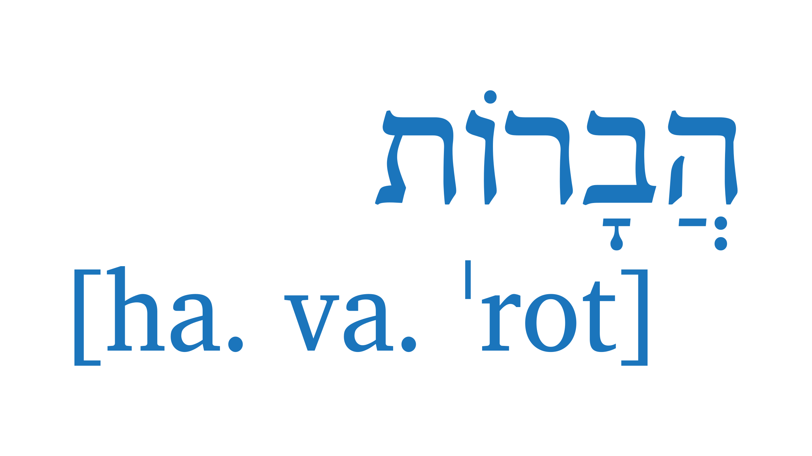

# havarotjs

A Typescript package for getting syllabic data about Hebrew text with niqqud.

The general idea of this package is that a `Text` is composed of `Words` which are composed of `Syllables` which are composed of `Clusters` which are composed of `Characters`.

## install

Using `npm`:

```
npm install havarotjs
```

To call using TypeScript:

```typescript
import { Text } from "havarotjs";
```

Or Node:

```javascript
const havarot = require("havarotjs");
const Text = havarot.Text;
const heb = new Text("אֱלֹהִים");
```

## example

```typescript
import { Text } from "havarotjs";
const heb = "אֱלֹהִים";
const text = new Text(heb);
const sylText = text.syllables.map((syl) => syl.text);
sylText;
//  [
//    "אֱ"
//    "לֹ"
//    "הִים"
//  ]
```

## Docs

Read the docs at online [here](https://charlesloder.github.io/havarot/)

## Contributing

Free to open an issue or pull request.

See the [terms list](https://charlesloder.github.io/havarot/pages/Linguistic/terms.html) for a list of naming conventions.
