When the [`Text`](/api/classes/text) is class is used, a complex graph structure is created.



## Overview

The [`Node`](/api/classes/node) class is a doubly-linked node that forms a hierarchical tree structure. It supports both **lateral traversal** (siblings) and **vertical traversal** (parent-child relationships).

## Traversal patterns

### Lateral traversal (siblings)

Navigate left and right within the same level:

```typescript
const text = new Text("בְּרֵאשִׁ֖ית בָּרָ֣א אֱלֹהִ֑ים");
const firstWord = text.words[0];

// Move forward
const secondWord = firstWord.next;

// Move backward
const backToFirst = secondWord?.prev;
```

:::note
Nodes do not cross their parent's boundaries. Example: the `.next` property on the final `Syllable` of `Word` is `null` even if `Word.next` is not `null`.
:::

### Vertical traversal (parent-child)

Navigate up and down the hierarchy:

```typescript
const text = new Text("בְּרֵאשִׁ֖ית בָּרָ֣א אֱלֹהִ֑ים");
const firstWord = text.words[0];
const firstSyllable = firstWord.syllables[0];

// Down: parent → children
const syllables = firstWord.syllables;
const clusters = firstSyllable.clusters;

// Up: child → parent
const parentWord = firstSyllable.word; // or firstSyllable.parent?.value
const parentSyllable = clusters[0].syllable; // or clusters[0].parent?.value
```

### Combined traversal

You can combine both patterns to navigate anywhere in the graph:

```typescript
const text = new Text("בְּרֵאשִׁ֖ית בָּרָ֣א אֱלֹהִ֑ים");

const thirdWord = text.words[1]; // אֱלֹהִ֑ים
const lastSyllable = thirdWord.syllables[2]; // הִ֑ים
const firstCluster = lastSyllable.clusters[0]; // הִ֑
const firstChar = firstCluster.chars[0]; // ה

// Navigate to next cluster's chars
const nextCluster = firstCluster.next;
const nextChars = nextCluster?.chars;
```
